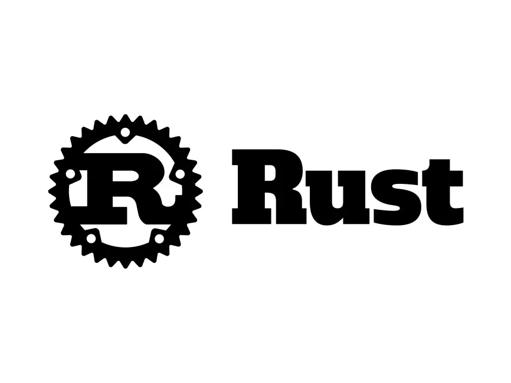

# Rust Programming Langauge
  
Programming languages usually have some tradeoffs. There are low level languages like C anc C++ usually have speed and control at the cost of memory safety. On the other hand, we high level languages such as python or java script are more safer but are not very efficient from power and speed perspectives. With rust we have best of both the worlds. More specifically, it is a system programming language which means they have speed and control but at the same time are much much better because of the safety features just like high level languages. This makes rust so clearly standout among all the other programming languages.<br />

## How to Install Rust?
(Official Web site Link)[https://www.rust-lang.org/]
All necessary information is present on this official website. <br />
I am using Windows Subsystem for Linux, so i follow this
```ruby
curl --proto '=https' --tlsv1.2 -sSf https://sh.rustup.rs | sh
```
Then you got this as mention below on terminal and hit 1.
```
info: downloading installer

Welcome to Rust!

This will download and install the official compiler for the Rust
programming language, and its package manager, Cargo.

Rustup metadata and toolchains will be installed into the Rustup
home directory, located at:

  /root/.rustup

This can be modified with the RUSTUP_HOME environment variable.

The Cargo home directory is located at:

  /root/.cargo

This can be modified with the CARGO_HOME environment variable.

The cargo, rustc, rustup and other commands will be added to
Cargo's bin directory, located at:

  /root/.cargo/bin

This path will then be added to your PATH environment variable by
modifying the profile files located at:

  /root/.profile
  /root/.bashrc

You can uninstall at any time with rustup self uninstall and
these changes will be reverted.

Current installation options:


   default host triple: x86_64-unknown-linux-gnu
     default toolchain: stable (default)
               profile: default
  modify PATH variable: yes

1) Proceed with standard installation (default - just press enter)
2) Customize installation
3) Cancel installation
```
Then you will get this on your terminal, just restart your shell.
```
Rust is installed now. Great!

To get started you may need to restart your current shell.
This would reload your PATH environment variable to include
Cargo's bin directory ($HOME/.cargo/bin).

To configure your current shell, you need to source
the corresponding env file under $HOME/.cargo.

This is usually done by running one of the following (note the leading DOT):
. "$HOME/.cargo/env"            # For sh/bash/zsh/ash/dash/pdksh
source "$HOME/.cargo/env.fish"  # For fish
```
## Editor
I will recommend to use the Visual Studio Code Editor. For installation go to
(VSCode)[https://code.visualstudio.com/docs/setup/windows] <br />
Installing Rust-analyzer extension in VsCode.<br />
## Rust Compiler and Package Manager
* Check in VsCode trminal weither rust compiler is installed or not by typing rustc --version. 
* Cargo is the package manager for rust which is resonsible for installing.uninstalling of any package in rust -> cargo --version. 
* For rust updates -> rustup update.

## Links to Useful Books on Rust
### Resources Covering Basic Concepts of the Language
1. Official rust programming language book. Recommended book for those who are new to rust.
(Rust Programming Language)[https://doc.rust-lang.org/book/]
2. A recommended book for those who want to quickly learn through examples with lesser focus on theory.
(Rust by Example)[https://doc.rust-lang.org/rust-by-example/print.html]
Description: 
3. Useful Examples for accomplishing common programming tasks.
(Rust Cookbook)[https://rust-lang-nursery.github.io/rust-cookbook/print.html]
4. A text book for those who are not native speakers and want to learn with simple and easy to follow English.
(Easy Rust)[https://dhghomon.github.io/easy_rust/]
5. A good reference book for the language
(Rust Reference)[https://doc.rust-lang.org/reference/introduction.html]
6. Small exercises to get you used to reading and writing Rust code.
(Rustlings (online resource only))[https://github.com/rust-lang/rustlings]
7. Quick reference guide and handy reference for programming in rust.
(Rust CheatSheet)[https://zerotomastery.io/cheatsheets/rust-cheat-sheet/]

### Resources Covering Advance Concepts of the Language
1. A recommended book for those who are coming from C++/JAVA background and want to develop for Andriod
(Comprehensive Rust)[https://google.github.io/comprehensive-rust/]
2. The book contains techniques that can improve the performance, speed and memory usage
(The Rust Performance Book)[https://nnethercote.github.io/perf-book/introduction.html]
3. It contains many examples and codes that explains the details when writing unsafe Rust programs.
(The Rustonomicon)[https://doc.rust-lang.org/nomicon/intro.html]
4. Basics of linked lists and different types of smart pointers in Rust.
(Learn Rust with Entirely Too Many Linked Lists)[https://rust-unofficial.github.io/too-many-lists/]
5. Useful programming examples and tips for effective rust programming.
(Rust Programming Tips)[https://github.com/ferrous-systems/elements-of-rust/blob/master/README.md]

### Documentation of the Language
1. Comprehensive guide to the Rust standard library APIs.
(Standard Library)[https://doc.rust-lang.org/std/index.html]
2. For understanding the Rust's way of introducing changes into the language
(Edition Guide)[https://doc.rust-lang.org/edition-guide/index.html]
3. Description: For understanding the package manager of Rust.
(Cargo Book)[https://doc.rust-lang.org/cargo/index.html]
4. Description: Listing of all the errors emitted by the compiler
(Compiler Error Index)[https://doc.rust-lang.org/error_codes/error-index.html]
5. Description: Understanding the generation of documentation for your code
(Rustdoc Book)[https://doc.rust-lang.org/rustdoc/index.html]

### Rust Reference Material/Cheat Sheets list
Extensive Level Cheat Sheets
1. An extensive cheat sheet touching almost all important aspects of the languages.
(The Rust Cheat Sheet by cheats.rs)[https://cheats.rs/]
2. A detailed overview of the syntax covering both beginner and advance level topics.
(Rust in a Nutshell)[https://github.com/donbright/rust-lang-cheat-sheet/blob/master/README.md]
3. Another detailed and extensive cheat sheet.
(Rust Cheat Sheet by Zero to Mastery)[https://zerotomastery.io/cheatsheets/rust-cheat-sheet/]
4. Intermediate level cheat sheet.
(LGR Rust Cheat)[https://docs.google.com/document/d/1kQidzAlbqapu-WZTuw4Djik0uTqMZYyiMXTM9F21Dz4/edit]
5.  Brief and a quick reference.
(Rust Cheat Sheet by QuickRef.Me)[https://quickref.me/rust.html]
6. A one pager cheat sheet.
(Rust Cheat Sheet)[https://phaiax.github.io/rust-cheatsheet/]